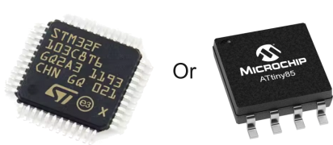

# Antenna Alignment Based on Wi-Fi Signal Strength

This project adjusts an antenna's position using servo and BLDC motors to find the optimal alignment based on Wi-Fi signal strength (RSSI) received by a Raspberry Pi Zero 2 W or Radxa Zero 3W. The system enhances connectivity by aligning the antenna to maximize the signal strength, measured using `iwconfig`.

## Features

### **1 Axis (0-180° Servo Motor)**

  

- Measures Wi-Fi signal strength (RSSI) using `iwconfig`.
- Adjusts the antenna's position with a single servo motor controlled by the Raspberry Pi Zero 2 W or Radxa Zero 3W.
- Optimizes the antenna's alignment over a limited range (0° to 180°).

### **2 Axis (360° Pan with BLDC Motor + 180° Tilt with Servo Motor)**

  

- Overcomes the limitations of the first version by adding a second axis for full 360° horizontal rotation and 180° vertical tilt.
- Measures signal strength for a broader range of alignments.
- Allows for precise adjustments in both horizontal and vertical planes, improving versatility and signal acquisition.

## Advantages of the 2-Axis Version

- **Overcomes Limitations**: The first version is constrained by a single-axis range of 0° to 180°, which is insufficient for full directional optimization.
- **Broader Coverage**: The second version covers the entire 360° horizontally, enabling complete alignment in any direction.
- **Precision in Two Dimensions**: Combines horizontal and vertical adjustments to ensure the antenna can be perfectly aligned in both planes.
- **Improved Signal Acquisition**: Maximizes the chances of locating the optimal signal direction, especially in environments with obstructions or multipath interference.

## PCB Motor Controller: STSPIN230 or STSPIN830 with ATtiny85 or STM32F103

  
`

To control the BLDC motor in the 2-axis version, a custom PCB using the STSPIN230 or STSPIN830 motor driver was developed. The controller supports both the ATtiny85 and STM32F103 for versatile microcontroller options.

## License

This project is licensed under the MIT License. See the [LICENSE](LICENSE) file for more information.

